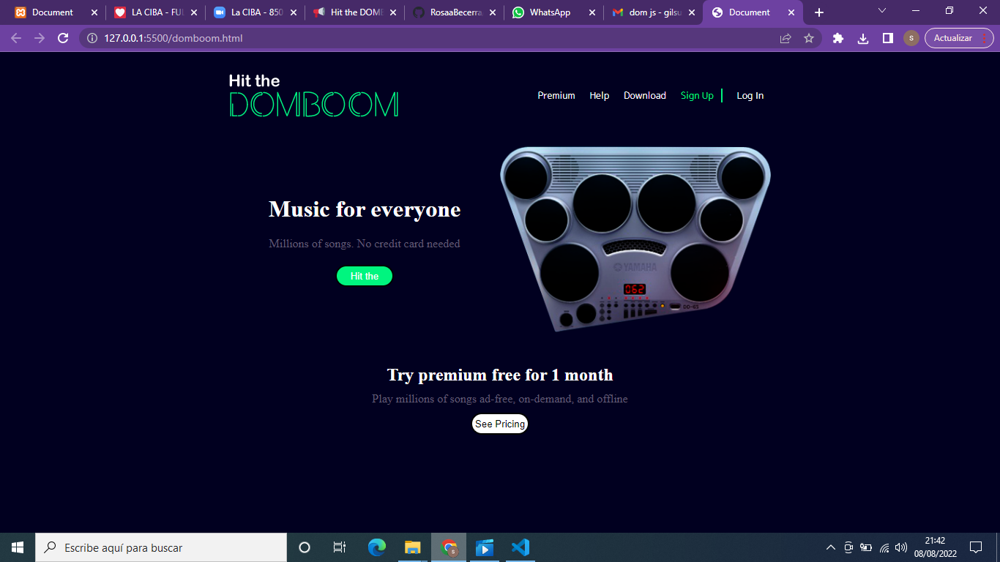
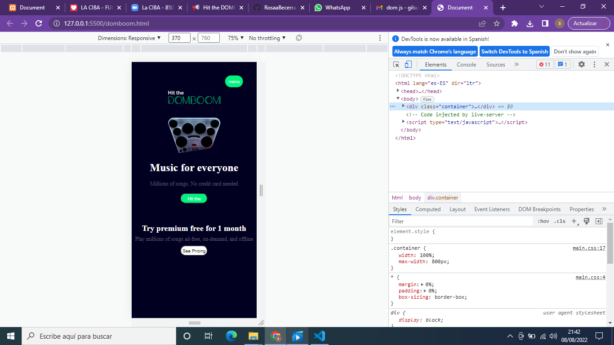

## Tabla de Contenidos
1. [Información General](#información-general)
2. [Capturas de Pantalla](#capturas-de-pantalla)
3. [Tecnologías](#tecnologías)
4. [Instalación](#instalación)
5. [Soporte](#soporte)
6. [Hoja de ruta](#hoja-de-ruta)
7. [Autores](#autores)


***
## Información General

🧑🏼‍🏫 Un cliente nos solicitó el desarrollo de una landing page para su empresa de instrumentos musicales, porque planea vender su producto estrella, una batería electronica (drumkit).

Esta landing page tuvo como prioridad el que el usuario pudiese interactuar con el drumkit, de tal forma que cuando diese click a cada uno de los "pads" se escuchase un sonido diferente.

Otra de las sulicitudes fue que dicho diseño se adapatase y funcionase en cualquier dispositivo, es decir que tuviese un diseño responsive.

*Proyecto en proceso de desarrollo.*   

***

## Capturas de pantalla


***

***


## Tecnologías

Lista de tecnologías usadas en el desarrollo del proyecto:

* HTML: Version HTML 5 
* CSS: Version CSS3
* JavaScript: Version JavaScript 5 

***

## Instalación
Como instalar el repositorio:

1. Ingresar en Visual Studio Code
2.  Clonar el proyecto con el comando: 
``` 
git clone https://github.com/RosaaBecerra/domboom.git
```

***

## Soporte

Si tiene cualquier problema póngase en contacto con: 
>emailEjemplo@gmail.com

***

## Hoja de ruta

En un futuro esta web deberá completarse haciendo funcionales los botones de Premium, Help, Download, SignUp, LogIn, Hit the y seepricing; derivando a las páginas correspondientes y sus distintas funcionalidades.

***

## Autores

* **Susana Gil** 
* **Rosa Becerra** 
* **Nadiale Bados** 
* **Shufen Chen**


